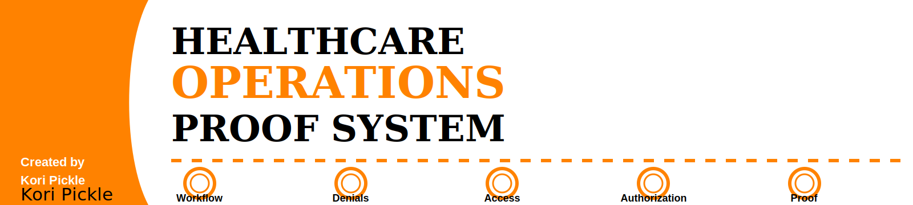

# Healthcare Operations Proof System

A branded healthcare operations portfolio system focused on workflow breakdowns, denial prevention, patient access, prior authorization, revenue cycle visibility, and operational proof-of-work.

## Quick Navigation

| Section | Purpose |
|---|---|
| [Design System](design-system/) | Brand colors, visual identity rules, and design standards |
| [Proof Framework](proof-framework/) | Reusable workflow, case study, and metric tracking templates |
| [Project Examples](project-examples/) | Healthcare operations proof-of-work examples |
| [LinkedIn Assets](linkedin-assets/) | Featured section copy and portfolio caption templates |
| [Assets](assets/) | Banner and visual files |

## Brand Colors

| Brand Role | Hex Code | Use |
|---|---:|---|
| Primary Background | #FFFFFF | Clean portfolio backgrounds, case study pages, documentation space, visual layouts |
| Accent Color | #FF8200 | Workflow nodes, section dividers, callouts, key risks, proof points, urgency markers |
| Font Color | #000000 | Main text, headings, labels, tables, workflow steps, proof statements |

## Brand Identity

This system uses a clean healthcare operations identity built around white space, black clarity, and Tennessee Orange urgency.

Visual direction:

- White background
- Tennessee Orange accent system
- Black typography
- Premium editorial healthcare operations feel
- Double-ring circular workflow nodes
- Dotted connector lines
- Strong spacing
- Clean operational structure
- Recruiter-readable proof-of-work format

## Purpose

This repository is designed to turn healthcare administration coursework, patient-to-professional insight, workflow observations, and revenue cycle concepts into visible proof-of-work.

The goal is to show practical operational thinking before formal work experience by building structured examples of how healthcare workflows break, how those failures affect revenue cycle outcomes, and how those breakdowns can be prevented.

## Core Positioning

Healthcare operations problems rarely appear all at once.

They usually begin as small workflow breakdowns:

- unclear ownership
- missing handoffs
- incomplete documentation
- unverified eligibility
- missed authorization requirements
- delayed follow-up
- weak visibility across teams

This proof system turns those breakdowns into clear workflow maps, risk tables, case studies, and portfolio-ready examples.

## Focus Areas

| Focus Area | What It Proves |
|---|---|
| Workflow Breakdown Analysis | Ability to identify where operational failure begins |
| Denial Prevention | Understanding of upstream revenue cycle risk |
| Patient Access | Awareness of intake, eligibility, clearance, and scheduling workflows |
| Prior Authorization | Ability to map payer-rule and documentation dependencies |
| Revenue Cycle Visibility | Understanding of claim flow, rework, A/R delays, and operational bottlenecks |
| Operational Proof-of-Work | Ability to translate learning into visible, recruiter-readable projects |

## Repository Files

### Design System

| File | Purpose |
|---|---|
| [brand-colors.md](design-system/brand-colors.md) | Defines the strict white, Tennessee Orange, and black brand system |
| [visual-identity-rules.md](design-system/visual-identity-rules.md) | Defines layout rules, visual tone, and brand consistency standards |

### Proof Framework

| File | Purpose |
|---|---|
| [workflow-breakdown-template.md](proof-framework/workflow-breakdown-template.md) | Reusable template for analyzing where healthcare workflows break |
| [case-study-template.md](proof-framework/case-study-template.md) | Reusable case study format for healthcare operations examples |
| [metric-tracking-template.md](proof-framework/metric-tracking-template.md) | Template for defining, tracking, and interpreting workflow metrics |

### Project Examples

| File | Purpose |
|---|---|
| [denial-prevention-proof.md](project-examples/denial-prevention-proof.md) | Shows how upstream workflow issues become downstream denials |
| [eligibility-verification-proof.md](project-examples/eligibility-verification-proof.md) | Shows how eligibility verification protects clean claim readiness |
| [prior-authorization-proof.md](project-examples/prior-authorization-proof.md) | Shows how authorization visibility affects patient access and reimbursement |
| [patient-access-proof.md](project-examples/patient-access-proof.md) | Shows how patient access workflows affect downstream revenue cycle stability |

### LinkedIn Assets

| File | Purpose |
|---|---|
| [featured-section-copy.md](linkedin-assets/featured-section-copy.md) | Copy for adding this portfolio to LinkedIn Featured |
| [portfolio-caption-template.md](linkedin-assets/portfolio-caption-template.md) | Reusable caption template for posting portfolio updates |

## Build Plan

| Build | Project | Purpose |
|---:|---|---|
| 01 | Denial Prevention Proof | Show how upstream workflow issues become downstream denials |
| 02 | Eligibility Verification Proof | Show how front-end data quality protects clean claim readiness |
| 03 | Prior Authorization Proof | Show how payer rules, documentation, and status tracking affect patient access and reimbursement |
| 04 | Patient Access Proof | Show how scheduling, intake, clearance, and communication affect workflow stability |
| 05 | Revenue Cycle Visibility Proof | Show how operational metrics reveal bottlenecks, rework, and risk |

## Resume-Ready Value

This repository demonstrates:

- healthcare workflow analysis
- revenue cycle thinking
- denial prevention logic
- patient access process awareness
- prior authorization workflow mapping
- operational root-cause thinking
- portfolio documentation
- visual healthcare communication

## Data and Privacy Disclaimer

All examples in this repository use fictional, synthetic, or general workflow scenarios. No protected health information, patient records, payer account details, claim numbers, authorization numbers, screenshots from private systems, or confidential organizational data are included.

## Created By

Created by Kori Pickle

Kori Pickle

Healthcare Administration | Revenue Cycle | Workflow Analysis | Patient Access | Operational Proof-of-Work
