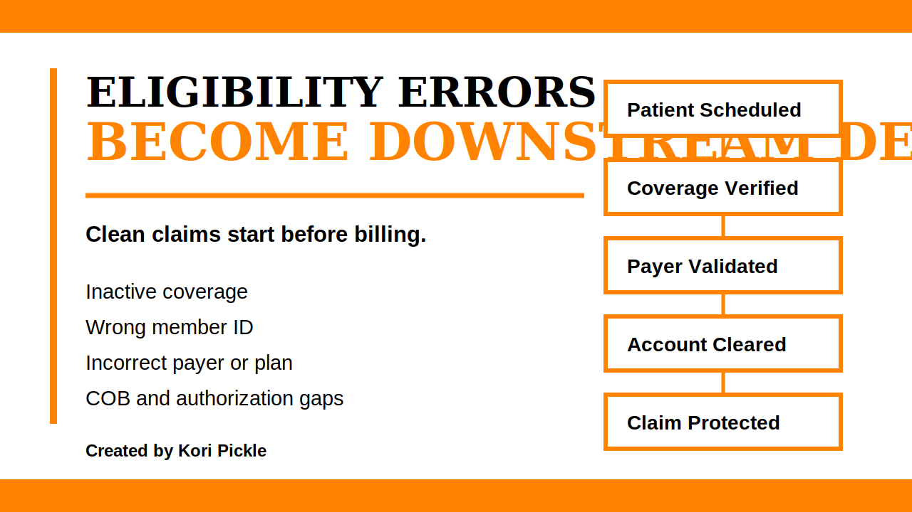

# Eligibility Verification Proof Case Study



## Brand Colors

| Brand Role | Hex Code | Use |
|---|---:|---|
| Primary Background | #FFFFFF | Case study pages, workflow visuals, documentation space |
| Accent Color | #FF8200 | Section dividers, workflow markers, risk highlights, metric emphasis |
| Font Color | #000000 | Headings, body text, table labels, workflow steps |

## Purpose

This proof-of-work case study shows how eligibility verification protects clean claim readiness before the patient encounter happens. The goal is to demonstrate how front-end data accuracy, payer validation, coordination of benefits, authorization checks, and financial clearance reduce preventable denials and revenue cycle rework.

## Core Analyst Insight

Eligibility verification is not just a registration task.

It is an upstream revenue cycle checkpoint that affects denials, patient billing clarity, authorization requirements, financial clearance, and A/R workload.

## Problem

Eligibility errors often begin before the claim is ever submitted. When insurance information is incomplete, inactive, outdated, or tied to the wrong payer or plan, the downstream impact may appear later as claim rejections, coverage denials, authorization delays, patient billing confusion, or A/R follow-up work.

Common front-end breakdowns include:

- inactive coverage not identified before service
- incorrect member ID or subscriber information
- wrong payer or plan selected
- coordination of benefits not reviewed
- authorization or referral requirement missed
- patient responsibility not clearly communicated
- account not financially cleared before the visit

## Workflow Map

```text
Patient Scheduled
  |
  v
Insurance Information Collected
  |
  v
Coverage Status Verified
  |
  v
Member ID and Subscriber Information Confirmed
  |
  v
Payer and Plan Type Validated
  |
  v
Coordination of Benefits Reviewed
  |
  v
Referral or Authorization Requirement Checked
  |
  v
Patient Responsibility Communicated
  |
  v
Account Cleared Before Service
  |
  v
Claim Readiness Protected
```

## Root-Cause Breakdown

| Front-End Breakdown | Where It Starts | Downstream Risk | Prevention Strategy |
|---|---|---|---|
| Coverage not active | Registration or eligibility verification | Eligibility denial or patient balance confusion | Confirm active coverage for the exact date of service |
| Member ID entered incorrectly | Intake or registration | Claim rejection or payer mismatch | Validate member ID against payer record |
| Wrong payer selected | Registration or payer setup | Claim routes to incorrect payer | Confirm payer, plan type, and billing requirements |
| Coordination of benefits not reviewed | Eligibility verification | COB denial or delayed payment | Confirm primary and secondary payer order |
| Authorization requirement missed | Scheduling or patient access | Authorization denial or delayed reimbursement | Check payer rules before service |
| Patient responsibility unclear | Financial clearance | Patient billing confusion or collection difficulty | Communicate deductible, copay, or coinsurance estimate |
| Clearance status not visible | Patient access workflow | Appointment proceeds without complete readiness | Use account clearance status tracking |

## Operational Impact

When eligibility verification is weak, the organization may experience:

- preventable eligibility denials
- claim rejections
- authorization delays
- increased A/R workload
- patient billing confusion
- avoidable staff rework
- delayed reimbursement
- weaker clean claim performance
- less trust in front-end workflow accuracy

## Prevention Strategy

A stronger eligibility verification workflow should confirm the account is ready before the patient is seen.

Recommended checkpoints:

- verify active coverage for the date of service
- confirm patient demographics match payer records
- validate member ID and subscriber information
- confirm payer and plan type
- review coordination of benefits
- check referral requirements
- check prior authorization requirements
- communicate patient financial responsibility
- document account clearance status before service

## Metrics to Track

| Metric | What It Shows |
|---|---|
| Eligibility-related denial rate | Whether front-end verification is preventing coverage denials |
| Registration error rate | Whether intake data is accurate and complete |
| Clean claim rate | Whether claims are ready for accurate first-pass submission |
| Claim rejection volume | Whether payer or demographic data problems are recurring |
| COB-related denial rate | Whether primary and secondary coverage is being confirmed |
| Financial clearance completion rate | Whether accounts are ready before service |
| A/R days affected by eligibility issues | Whether eligibility breakdowns are delaying reimbursement |

## Analyst Recommendation

Eligibility verification should be treated as a revenue protection workflow, not just an intake task. The strongest improvement opportunity is to move payer validation, plan confirmation, COB review, authorization checks, and financial clearance earlier in the patient access process.

## Resume-Ready Skill Statement

Analyzed eligibility verification workflow risks across patient access, payer validation, coordination of benefits, authorization requirement checks, and financial clearance to identify preventable denial and claim readiness issues.

## LinkedIn Caption

I added a new healthcare operations proof-of-work example to my portfolio.

This one focuses on eligibility verification and how front-end data quality affects clean claim readiness, denial prevention, authorization accuracy, patient billing clarity, and A/R workload.

The goal is to show how patient access workflows protect the revenue cycle before the claim is ever submitted.

All examples are fictional or simulated. No PHI is used.

Created by Kori Pickle

## Created By

Created by Kori Pickle

Kori Pickle

## Data and Privacy Disclaimer

All examples in this case study are fictional, synthetic, or general workflow scenarios. No protected health information, patient records, payer account details, claim numbers, authorization numbers, screenshots from private systems, or confidential organizational data are included.
