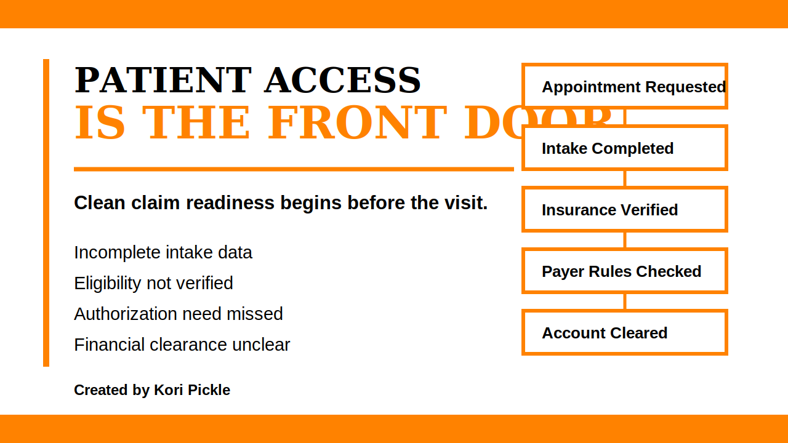

# Patient Access Proof Case Study



## Brand Colors

| Brand Role | Hex Code | Use |
|---|---:|---|
| Primary Background | #FFFFFF | Case study pages, workflow visuals, documentation space |
| Accent Color | #FF8200 | Section dividers, workflow markers, risk highlights, metric emphasis |
| Font Color | #000000 | Headings, body text, table labels, workflow steps |

## Purpose

This proof-of-work case study shows how patient access workflows affect scheduling, intake accuracy, eligibility verification, authorization readiness, financial clearance, patient communication, and downstream revenue cycle outcomes.

The goal is to demonstrate how front-end workflow stability protects clean claim readiness, reduces preventable denials, improves patient communication, and lowers administrative rework.

## Core Analyst Insight

Patient access is the front door of revenue cycle performance.

When intake, scheduling, eligibility, authorization, and financial clearance workflows are unstable, the downstream impact often appears later as denials, delays, rework, A/R aging, and patient confusion.

## Problem

Patient access breakdowns often begin before the clinical encounter. If intake data is incomplete, insurance is not verified, payer rules are not checked, or financial responsibility is not communicated clearly, the patient may move forward without the account being truly ready.

Common patient access breakdowns include:

- incomplete patient intake information
- inaccurate demographic or insurance data
- eligibility not verified before service
- payer rules not checked early enough
- referral or authorization need missed
- patient financial responsibility not communicated
- account clearance status not visible before appointment

## Workflow Map

```text
Appointment Requested
  |
  v
Patient Information Collected
  |
  v
Insurance Information Verified
  |
  v
Payer Rules Checked
  |
  v
Referral or Authorization Requirement Reviewed
  |
  v
Patient Financial Responsibility Communicated
  |
  v
Account Clearance Status Confirmed
  |
  v
Patient Seen With Account Ready
  |
  v
Clean Claim Readiness Protected
```

## Root-Cause Breakdown

| Patient Access Breakdown | Where It Starts | Downstream Risk | Prevention Strategy |
|---|---|---|---|
| Incomplete intake data | Scheduling or registration | Registration rework or claim rejection | Standardize required intake fields |
| Demographic mismatch | Registration | Claim rejection or payer mismatch | Confirm patient name, date of birth, address, and subscriber details |
| Insurance not verified | Eligibility verification | Eligibility denial or delayed reimbursement | Confirm active coverage before service |
| Payer rules not checked | Patient access workflow | Missed authorization or referral requirement | Review payer rules before appointment confirmation |
| Authorization need missed | Scheduling or authorization review | Authorization denial or delayed payment | Check authorization requirements before service |
| Patient responsibility unclear | Financial clearance | Billing confusion or collection difficulty | Communicate copay, deductible, or coinsurance estimate before service |
| Clearance status not visible | Patient access handoff | Appointment proceeds without readiness | Use account clearance status tracking |

## Operational Impact

When patient access workflows are unstable, the organization may experience:

- delayed patient scheduling
- claim rejections
- preventable eligibility denials
- authorization delays
- increased A/R workload
- patient billing confusion
- higher staff rework volume
- reduced clean claim performance
- weak visibility into account readiness before service

## Prevention Strategy

A stronger patient access workflow should confirm account readiness before the appointment occurs.

Recommended checkpoints:

- collect complete patient information during scheduling
- verify demographics against payer records
- confirm active insurance coverage
- validate payer and plan type
- review referral requirements
- review authorization requirements
- communicate patient financial responsibility
- document account clearance status
- assign ownership for unresolved issues
- prevent appointment progression when critical readiness items are incomplete

## Metrics to Track

| Metric | What It Shows |
|---|---|
| Financial clearance completion rate | Whether accounts are ready before service |
| Registration error rate | Whether intake data is accurate and complete |
| Eligibility-related denial rate | Whether insurance verification is protecting clean claim readiness |
| Authorization-related denial rate | Whether payer rules are being checked before service |
| Patient access delay volume | Whether front-end issues are delaying care |
| Claim rejection volume | Whether demographic or payer data errors are recurring |
| Rework volume | Whether preventable patient access corrections are consuming staff time |

## Analyst Recommendation

Patient access should be treated as a revenue cycle control point, not only an appointment intake function. The strongest improvement opportunity is to create a pre-service readiness workflow that connects scheduling, registration, eligibility verification, payer rule review, authorization checks, financial clearance, and patient communication before the encounter occurs.

## Resume-Ready Skill Statement

Analyzed patient access workflow risks across scheduling, intake accuracy, eligibility verification, payer rule review, authorization readiness, financial clearance, and account status visibility to identify preventable denial, delay, and rework points.

## LinkedIn Caption

I added a new healthcare operations proof-of-work example to my portfolio.

This one focuses on patient access and how scheduling, intake accuracy, eligibility verification, payer rule review, authorization readiness, financial clearance, and patient communication affect downstream revenue cycle outcomes.

The goal is to show how patient access protects clean claim readiness before billing ever begins.

All examples are fictional or simulated. No PHI is used.

Created by Kori Pickle

## Created By

Created by Kori Pickle

Kori Pickle

## Data and Privacy Disclaimer

All examples in this case study are fictional, synthetic, or general workflow scenarios. No protected health information, patient records, payer account details, claim numbers, authorization numbers, screenshots from private systems, or confidential organizational data are included.
